# Integration-in-a-box: case study

> **Short version.** At work I led the first version of an internal dashboard that pulls live data from a project-tracking API through a small server layer, and I've built browser tools that work with undocumented third-party APIs. Integration-in-a-box is the public, clean-room version of that skill: two made-up companies, the connector that links them, logins done the standard way, and ten deliberate failures with a runbook for each.

This page is written so that someone who has never written code can follow it. Technical words are explained the first time they appear, and there's a [glossary](#glossary) at the end.

[▶ Watch the 3½ minute walkthrough](docs/control-room-walkthrough.mp4): sign in, a sale, a delivery, then all ten breaks and their fixes.

---

## Contents

- [Chapter 1. At work](#chapter-1-at-work)
- [Chapter 2. The public build](#chapter-2-the-public-build)
  - [The story in one minute](#the-story-in-one-minute)
  - [What an integration is](#what-an-integration-is)
  - [A walk through the screens](#a-walk-through-the-screens)
  - [How it works](#how-it-works)
  - [Logins, done the standard way](#logins-done-the-standard-way)
  - [Webhooks: being told instead of asking](#webhooks-being-told-instead-of-asking)
  - [Break it: ten real failures](#break-it-ten-real-failures)
  - [Key decisions](#key-decisions)
  - [Languages and tools](#languages-and-tools)
  - [How I tested it](#how-i-tested-it)
  - [What went wrong while building it](#what-went-wrong-while-building-it)
  - [Planning a real customer integration](#planning-a-real-customer-integration)
  - [Run it yourself](#run-it-yourself)
- [Every claim on this page, and where it is backed up](#every-claim-on-this-page-and-where-it-is-backed-up)
- [Glossary](#glossary)

---

## Chapter 1. At work

> Written generically on purpose: no company, team, tool, customer or partner names, and no numbers.

### The problem

A support team ran weekly health reviews. To prepare, people jumped between exported spreadsheets and the project tracker, working out which issues mattered most this week and who they affected. The information existed, but in too many places.

### What I built

I led the first version of a dashboard that brings it onto one screen:

- It pulls work items from the project tracker's **API** (a way for one program to ask another for data), filtered by week and priority, and keeps the high-priority ones front and centre.
- It links each issue to the **customer accounts it affects**, using data from our warehouse, so the review can see who is impacted, not just what is broken.
- A small **server layer** sits between the browser and the tracker. The access token lives only on the server; the browser never sees it.
- It keeps working when the tracker's API has a bad moment: a short cache, a fallback to the last good data, and a mock mode for demos with no live access at all.

I built v1 while I was on that support team. They still use it in their weekly reviews and have carried it on from there. I've since moved into solutions engineering, and still help with some of their work.

Separately, the Chrome extensions I've led at work integrate with **undocumented third-party web APIs**: working out how another company's site serves its data, and coping when it changes without warning. That taught me how fragile other people's APIs can be, and why an integration has to fail loudly rather than quietly.

### Why there's a public build

That work is private. Integration-in-a-box takes the same ideas (a server in the middle, tokens kept away from the browser, retries, fallbacks, loud failures when the other side changes) and builds them in public, with made-up companies, so every part can be shown, run and tested.


---

## Chapter 2. The public build


### The story in one minute

- **Harbourline** (made up) sells inventory software. It knows how much stock there is.
- **Maple & Main** (made up) is a grocer with its own in-house system. It sells to shoppers and needs to know what's in stock.
- They don't speak the same language. Harbourline calls a product's stock `stock_level`; Maple & Main calls it `qty`.
- **The connector** is the piece I play the engineer for. It sends Maple & Main's orders to Harbourline, brings stock changes back, and translates between the two.
- **The control room** is a live screen showing all of it, including what happens when something breaks.

### What an integration is

Two pieces of software talking to each other automatically. Here's an everyday version:

> A shopper buys three eggs at Maple & Main. Maple & Main's system has to tell Harbourline, so Harbourline's stock goes down by three. Harbourline's new number has to come back to Maple & Main, so the shelf count is right for the next shopper.

Without an integration, someone retypes that. With a good one, it happens in a second, and when something goes wrong, someone finds out straight away, with a clear reason.

### A walk through the screens

| | |
|---|---|
| 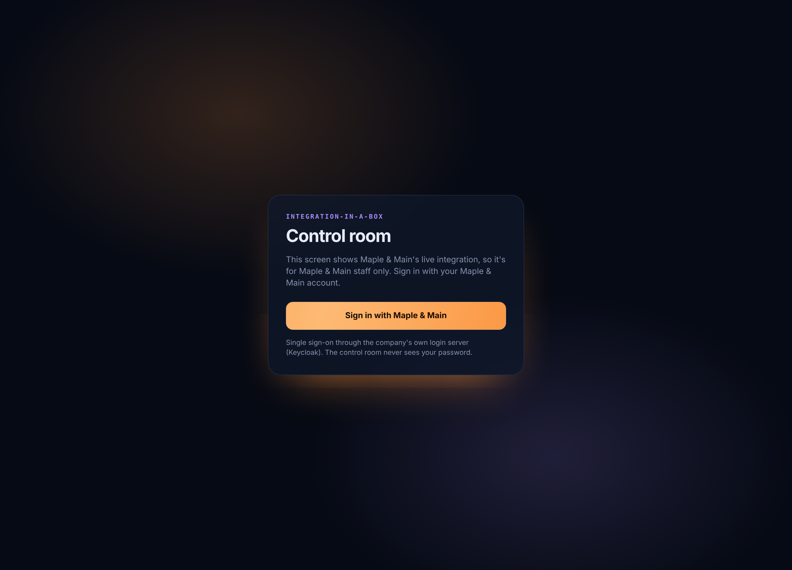 | **1. Locked.** The control room shows Maple & Main's live data, so it's for Maple & Main staff only. |
| 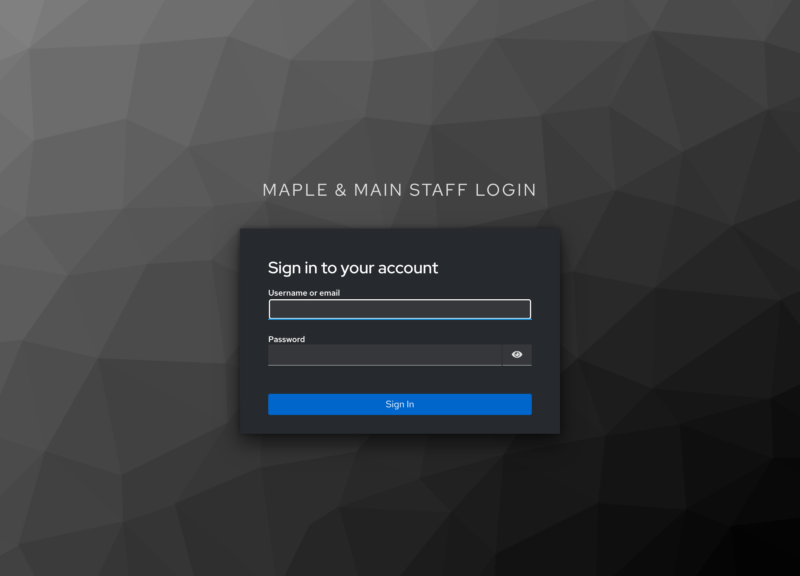 | **2. Single sign-on.** "Sign in with Maple & Main" goes to Maple & Main's own login page. The control room never sees the password. |
| 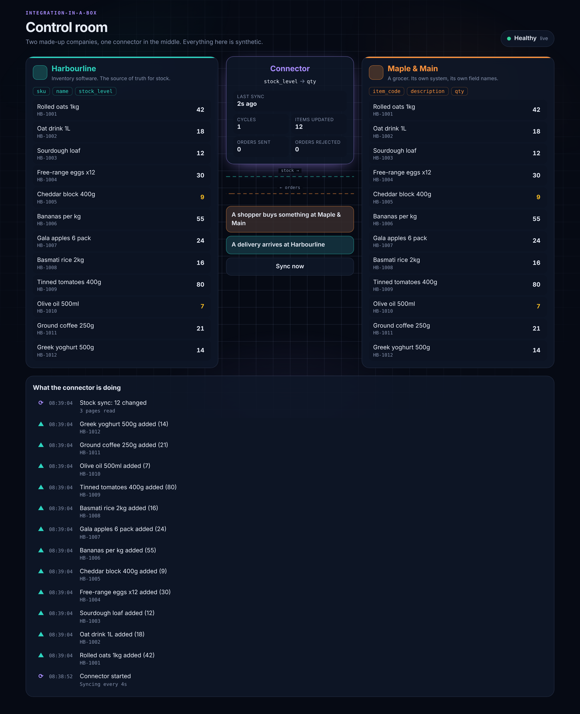 | **3. First sync.** Maple & Main's shelves start empty. The connector reads Harbourline's catalogue, five products per page, and fills them. |
|  | **4. A sale.** A shopper buys at Maple & Main. The order goes to Harbourline, stock drops, and the new number flows back. Numbers flash as they change. |
| 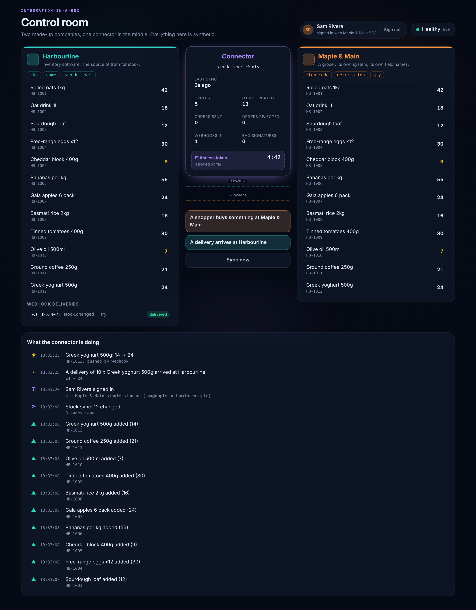 | **5. A delivery.** Stock arrives at Harbourline. Harbourline tells the connector straight away (a webhook), and Maple & Main updates within a second. |
| 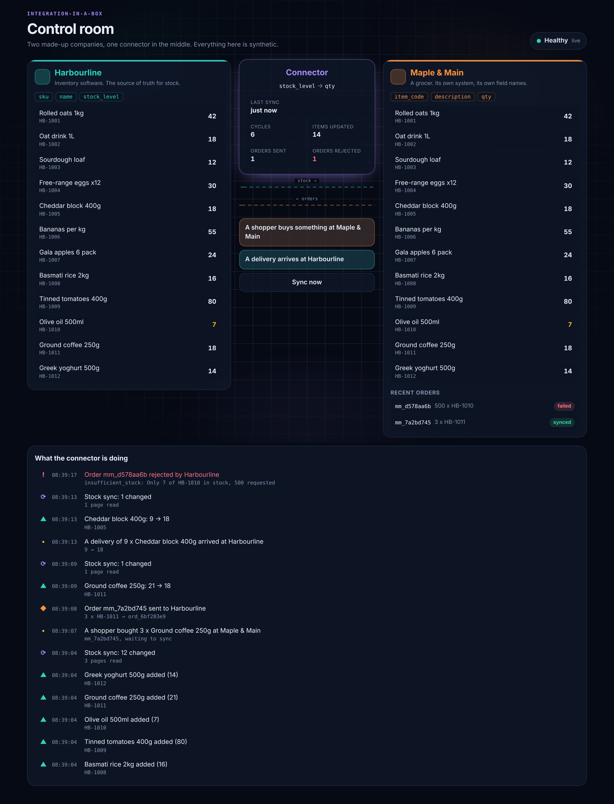 | **6. A refusal.** An order for 500 bottles of olive oil when there are 7. Harbourline says no, with a reason. The order is parked as **failed**, and the connector stays healthy: it did its job. |
| 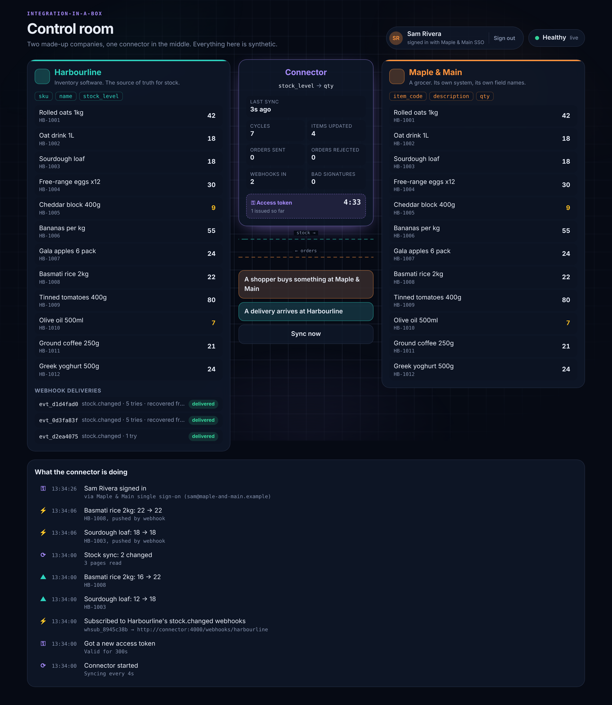 | **7. Recovery.** After the connector was switched off, Harbourline kept retrying. Both messages arrived on the 5th try: "recovered from: unreachable". |

### How it works


Four programs run together with one command (`docker compose up`):

| Part | What it is |
|---|---|
| **Harbourline API** | The vendor's API, designed first as a written spec ([docs/api/harbourline.openapi.yaml](docs/api/harbourline.openapi.yaml)), then built to match. Products, stock, orders, webhooks. |
| **Maple & Main API** | The grocer's own system, with its own names for things. |
| **Keycloak** | A free, widely used login server. It plays two roles: issuing passes to programs for Harbourline, and signing in Maple & Main's staff. |
| **Connector** | The integration. It syncs orders and stock, receives webhooks, signs staff into the control room, and runs the Break it switches. |

The connector's job, every few seconds:

1. **Send waiting orders** from Maple & Main to Harbourline. Each carries an **idempotency key** (the Maple & Main order number), so if the same order is ever sent twice, Harbourline returns the first one instead of creating a duplicate.
2. **Bring back stock changes.** After the first full sync, it only asks Harbourline for what changed since last time. It moves its "synced up to here" marker only once every page has been read, so nothing is skipped.
3. **Translate** using [mapping.json](mapping.json): `stock_level` → `qty`, `name` → `description`. If a field it needs is missing, it stops and names the field rather than writing blanks.

### Logins, done the standard way

There are two kinds of login, because there are two kinds of visitor.

**Programs: OAuth 2.0 client credentials.** The connector proves who it is to Keycloak and gets an **access token**: a pass valid for 5 minutes, addressed to Harbourline's API, carrying exactly three permissions (read inventory, write orders, manage webhooks). It reuses the pass and renews it 30 seconds before it expires. Harbourline checks every pass: genuine signature, trusted issuer, not expired, meant for Harbourline, and carrying the permission that specific call needs.

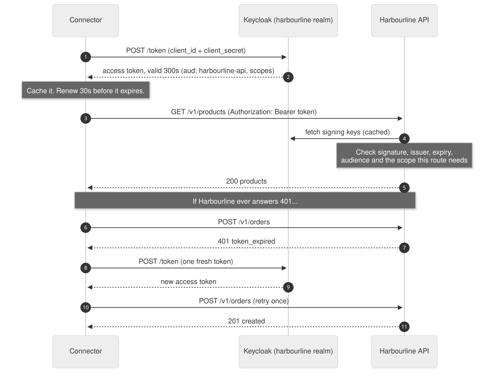

**People: OpenID Connect single sign-on, with PKCE.** Staff sign in on Maple & Main's own login page. The connector receives a one-time code, swaps it for tokens on the server, checks them, and gives the browser only a session cookie. PKCE (a one-time secret made for each sign-in) means a stolen code is useless on its own. Signing out ends the session at Keycloak too.

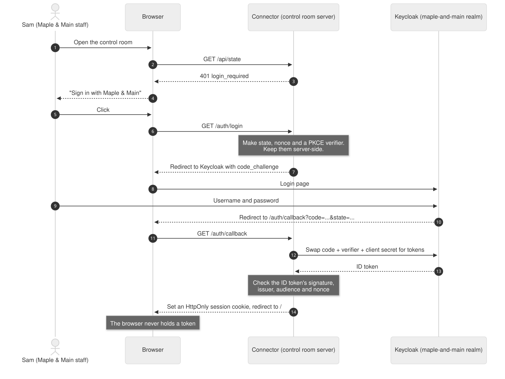

### Webhooks: being told instead of asking

Asking "anything new?" every few seconds (polling) is slow and wasteful. A **webhook** flips it: Harbourline calls the connector the moment stock changes.

That only works if the connector can trust the message, so every webhook is **signed**: Harbourline attaches a code computed from a shared secret, the time, and the exact message. The connector recomputes it and refuses anything that doesn't match, or that's more than 5 minutes old (so an old message can't be replayed). Messages seen before are ignored.

If the connector is down, Harbourline **retries** with growing gaps (1, 2, 4, 8, 16 seconds) and logs every attempt, giving up after 6. Polling still runs as a safety net.

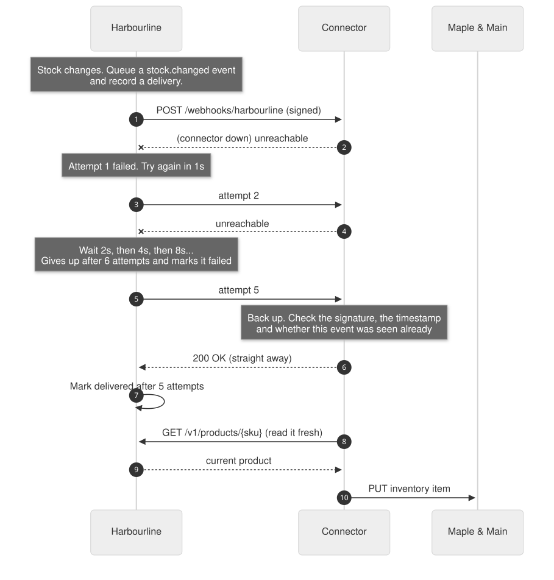

**Tested for real:** with everything running, I stopped the connector and changed stock twice. Harbourline tried each webhook 4 times ("unreachable"). When the connector came back, both arrived on the 5th try. Output: [while down](docs/outage-deliveries-while-down.txt), [after](docs/outage-deliveries-after.txt).

### Break it: ten real failures

Integrations are judged by what happens when things go wrong. The control room has a **Break it** panel: ten things that really happen, each caused for real (not faked on screen), each with a [runbook](docs/RUNBOOK.md) entry saying what you'll see, the cause, how to confirm it, the fix, and how to prevent it.


| # | Break | What the connector did (from the live run) | Health while broken | After the fix |
|---|---|---|---|---|
| 1 | Access token rejected | Logged the 401, got one new token, retried | green | green |
| 2 | Client secret rotated | `Login server: unauthorized_client`; orders waited | red | green, orders sent |
| 3 | Permission removed | `insufficient_scope (403)`; orders waited, not rejected | red | green, orders sent |
| 4 | Order accepted, reply lost | Retried with the same key: "already accepted, nothing doubled" | green | n/a |
| 5 | Webhooks out of order | "webhook said 65, but Harbourline has 62 now (an older event); used 62" | green | green |
| 6 | Rate limit (429) | Paused for exactly the `Retry-After` time (1s, 1s, 2s in the log) | green | green |
| 7 | Field renamed | Stopped and named the missing field; wrote nothing | red | green |
| 8 | Harbourline too slow | Timed out after 5s; work waited | red | green |
| 9 | Forged webhook | Refused: bad signature; nothing changed | green | n/a |
| 10 | Outage (503) | Everything waited | red | green, all sent |

Full log for every break: [docs/breaks-evidence.md](docs/breaks-evidence.md).

The rule behind most of these is one decision the connector makes on every failure: **will retrying help?**


### Key decisions

| Decision | Why | What I didn't do |
|---|---|---|
| **Design the API first** | Customers read the spec before any code. It forces naming and error codes to be thought through. | Build first and document later. |
| **Idempotency keys on every order** | A lost reply (break 4) is normal on networks. Without a key, it becomes a double order. | Hope retries are rare. |
| **Wait vs park** | Login, permission, rate-limit and outage problems are fixable, so the work waits. Bad data won't change on retry, so it's parked with the reason. | Retry everything forever, or give up on everything. |
| **Webhooks are hints, not the truth** | On a webhook, the connector reads the product fresh. Late or out-of-order webhooks (break 5) can't put an old number back. | Write the number in the webhook straight in. |
| **Fail loudly on missing fields** | A renamed field (break 7) stops the sync with the field's name, instead of filling shelves with zeros. | Default missing values to 0 or blank. |
| **Tokens never reach the browser** | The control room server holds the tokens; the browser holds a session cookie. Same pattern as my work dashboard. | Store tokens in the browser. |
| **Real Keycloak, run with Docker** | It's how this is done in industry, and the setup gotchas (like the two-addresses issuer problem in the runbook) are part of the lesson. | A pretend login. |

### Languages and tools

| What | Used for |
|---|---|
| **TypeScript, Node.js** | All three services and the connector |
| **Fastify** | The web servers (APIs) |
| **SQLite** | Each company's database: a single file, no database server |
| **Keycloak** | Logins: OAuth 2.0 and OpenID Connect |
| **jose** | Checking tokens' signatures and claims |
| **React, Framer Motion** | The control room and its animations |
| **Docker Compose** | Starting everything with one command |
| **Vitest** | 49 automated tests |
| **Playwright** | Screenshots, the walkthrough video, and the live break run (not part of the product) |
| **Mermaid** | Diagrams, written as text |

### How I tested it

- **49 automated tests** (`npm test`), including all three services running for real on random ports. A small stand-in login server signs real tokens, so token checks are tested without Keycloak.
  - API rules: paging, idempotency, all-or-nothing orders, error codes.
  - Tokens: expired, wrong audience, untrusted issuer, wrong key, missing permission (403), reuse, one retry after a rejection.
  - Webhooks: signatures, tampering, replays, duplicates, retries until recovery, giving up after 6, and re-subscribing without losing waiting deliveries.
  - **One test for each of the ten breaks**, proving it's detected and recovers.
- **The full stack in Docker**, with real Keycloak: sign-in through the real login page, a webhook outage, and all ten breaks run live with the connector's log recorded.

### What went wrong while building it

1. **A bug that would have lost webhooks.** Re-subscribing (which the connector does on every restart) deleted the old subscription, leaving deliveries waiting to retry pointing at nothing. Wrote a failing test, then fixed it to keep the subscription and only rotate the secret. The outage test only passes because of this.
2. **A health badge that cried wolf.** Screenshots showed "Problem, retrying" after an order was correctly rejected for lack of stock. That's handled, not broken; now only real trouble turns it red.
3. **A test built on a wrong assumption.** I assumed rotating signing keys makes old tokens fail at once. It doesn't (keys are cached, which is correct), so the test now uses a real cause: clock skew.
4. **An unhelpful error.** When the login server refused the connector, the log said only "Invalid client credentials". The break-2 test caught it; it now says "Login server: unauthorized_client" too.
5. **A quiet recovery.** Break 1 recovered so smoothly the log never showed the 401. The person on call should see it; now it's logged.
6. **Two Docker gotchas** that are now runbook entries: "localhost refused to connect" while the connector is still starting, and Keycloak's two addresses (browser vs containers) needing a fixed issuer.

Full dated log: [NOTES.md](NOTES.md).

### Planning a real customer integration

The build is half the job. [docs/PLANNING-A-CUSTOMER-INTEGRATION.md](docs/PLANNING-A-CUSTOMER-INTEGRATION.md) covers the other half: the discovery questions to ask first, a typical six-week timeline, the testing plan, and a go-live checklist.

### Run it yourself

You need Docker (Docker Desktop, or Colima with the Compose plugin).

```bash
git clone https://github.com/kmsmohamedansar/kmsmohamedansar.github.io.git
cd kmsmohamedansar.github.io/projects/integration-in-a-box
docker compose up --build
```

Open http://localhost:4000 and sign in as **sam / maple-demo**. All passwords and secrets in this project are made-up, dev-only values.

---

## Every claim on this page, and where it is backed up

| Claim | Evidence |
|---|---|
| 49 automated tests pass | `npm test`; files in `test/` |
| API designed first | `docs/api/harbourline.openapi.yaml`; NOTES.md order of work |
| Idempotency: same key returns the original order | `test/harbourline.test.ts`; break 4 in `docs/breaks-evidence.md` |
| Sync reads 5 per page and only what changed | `PAGE_SIZE` in docker-compose.yml; `updated_since` in `src/connector/sync.ts`; tests in `test/integration.test.ts` |
| Tokens valid for 300s, renewed 30s early, one retry on 401 | `keycloak/harbourline-realm.json`; `src/connector/token.ts`; `src/connector/clients.ts`; `test/auth.test.ts` |
| Harbourline checks signature, issuer, expiry, audience, scope | `src/harbourline/auth.ts`; `test/auth.test.ts` |
| Single sign-on with PKCE; browser gets only a cookie | `src/connector/sso.ts`; screenshots 09–11, 15 |
| Webhooks signed, replay window 5 minutes, duplicates ignored | `src/shared/webhook-signature.ts`; `src/connector/webhook-receiver.ts`; `test/webhooks.test.ts` |
| Retries at 1, 2, 4, 8, 16s; failed after 6 | `src/harbourline/webhooks.ts`; `test/webhooks.test.ts` |
| Outage: 4 failed attempts, delivered on the 5th | `docs/outage-deliveries-*.txt`; NOTES.md |
| Ten breaks, each detected and recovered | `test/breaks.test.ts`; `docs/breaks-evidence.md`; walkthrough video |
| Re-subscribe bug found and fixed | test "still delivers deliveries that were waiting…" in `test/webhooks.test.ts`; NOTES.md |
| Chapter 1 facts | Mohamed's own account; private work, not in this repo |

## Glossary

- **API:** a set of requests one program can make to another, like a menu.
- **Access token:** a short-lived pass a program shows with each request, proving who it is and what it's allowed to do.
- **Audience:** who a token is meant for. A token for another API is refused, even if it's genuine.
- **Client credentials:** the OAuth flow for a program logging in as itself, with an id and a secret.
- **Connector:** the program that links two systems.
- **Idempotency key:** a label on a request so that sending it twice has the same effect as sending it once.
- **Issuer:** the login server that made a token. Harbourline only trusts one.
- **Keycloak:** a free, open-source login server used widely in industry.
- **OAuth 2.0 / OpenID Connect:** the standard rules for issuing passes to programs (OAuth) and signing in people (OpenID Connect).
- **PKCE:** a one-time secret made for each sign-in, so a stolen sign-in code is useless on its own.
- **Polling:** asking "anything new?" on a timer.
- **Rate limit:** the most requests an API accepts in a period. Going over gets a 429 and a "try again in N seconds".
- **Realm:** a separate identity system inside Keycloak, with its own users and settings.
- **Runbook:** a guide for whoever's on call: symptom, cause, how to confirm, fix, prevention.
- **Scope:** a named permission inside a token, like `orders:write`.
- **Single sign-on (SSO):** signing in once, with your company's own login page, for many apps.
- **Webhook:** a message one system sends to another when something happens, instead of waiting to be asked.
