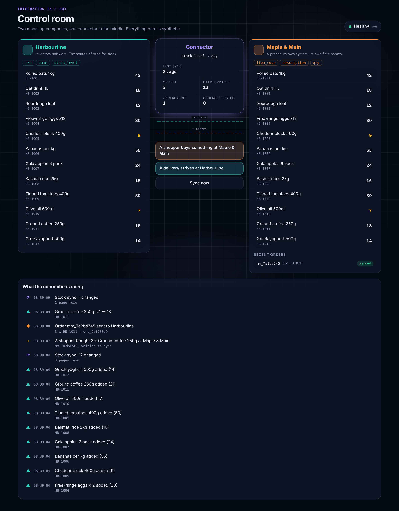
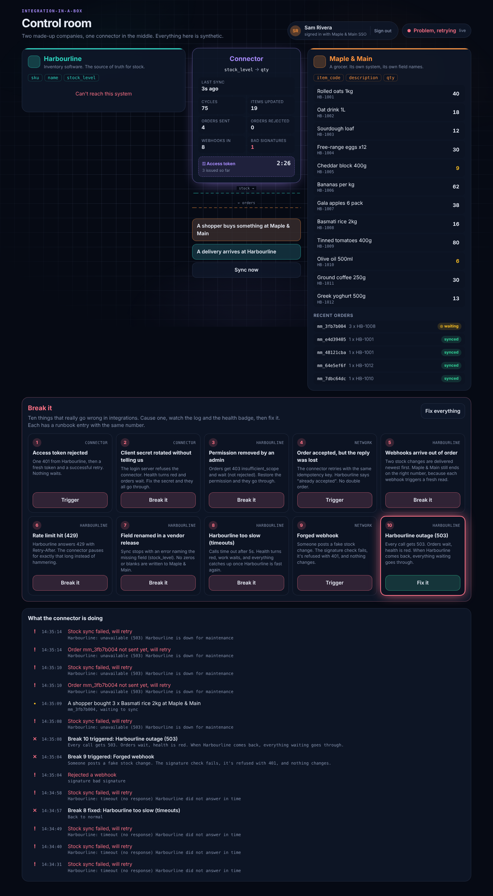
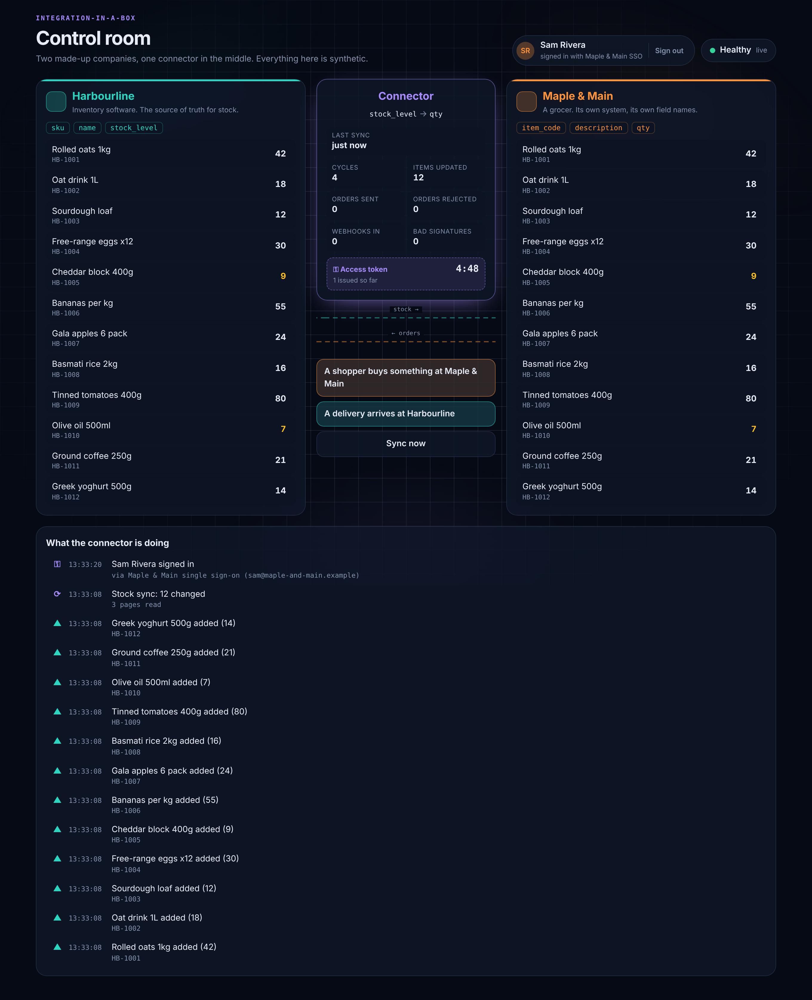

# Integration-in-a-box

Two made-up companies, and the engineer who connects them.

- **Harbourline** sells inventory software. It's the source of truth for stock.
- **Maple & Main** is a grocer with its own system and its own names for things (`item_code`, `description`, `qty` instead of `sku`, `name`, `stock_level`).
- **The connector** sits in the middle. It sends Maple & Main's orders to Harbourline, pulls stock changes back, and translates between the two using a mapping file.
- **The control room** is a live dashboard that shows all of it happening, and what happens when it goes wrong.

Everything is synthetic. Both companies and all their data are fictional.

**Read the [case study](CASE_STUDY.md)** for the full story, diagrams and results, or [watch the 3½ minute walkthrough](docs/control-room-walkthrough.mp4). On call? Go straight to the [runbook](docs/RUNBOOK.md).



## Run it

You need [Docker Desktop](https://www.docker.com/products/docker-desktop/).

```bash
docker compose up --build
```

Open **http://localhost:4000** for the control room and sign in as **sam / maple-demo** (a made-up Maple & Main staff account). Press the buttons in the middle to make a shopper buy something or a delivery arrive, and watch the connector move the data.

Other addresses:

- Harbourline API: http://localhost:4001/v1/products (needs an access token, see below)
- Maple & Main API: http://localhost:4002/api/inventory
- Keycloak, the login server: http://localhost:8080 (admin / admin)

Get an access token the way the connector does, then call Harbourline with it:

```bash
TOKEN=$(curl -s -X POST localhost:8080/realms/harbourline/protocol/openid-connect/token \
  -d grant_type=client_credentials -d client_id=maple-connector \
  -d client_secret=dev-only-connector-secret-change-me | jq -r .access_token)
curl -s localhost:4001/v1/products -H "Authorization: Bearer $TOKEN"
```

Every password and secret in this project is a made-up, dev-only value for a local demo.

Stop with `Ctrl+C`. Add `-v` to `docker compose down -v` to wipe the data and start fresh.

**If http://localhost:4000 refuses to connect:** the connector starts last, after Keycloak (about 30 seconds the first time) and the two APIs. Run `docker compose ps` to see which containers are up, and `docker compose logs connector` to see whether it started. If `docker compose` itself isn't found, install the Compose plugin (it comes with Docker Desktop; with Homebrew, `brew install docker-compose`).

## Break it (milestone 3)



Ten real failures, each caused for real from the control room and each with a [runbook](docs/RUNBOOK.md) entry: token rejected, client secret rotated, permission removed, lost reply, out-of-order webhooks, rate limit, renamed field, timeouts, forged webhook, outage. [test/breaks.test.ts](test/breaks.test.ts) proves each one is detected and recovers, and [docs/breaks-evidence.md](docs/breaks-evidence.md) has the connector's log from a live run of all ten.

The switches only exist when `CHAOS_KEY` is set, which the demo's `docker-compose.yml` does and a real deployment never would.

## Logins and webhooks (milestone 2)



| Piece | What it shows |
|---|---|
| **Keycloak, two realms** | One login server, two separate identity systems: Harbourline's (for programs) and Maple & Main's (for staff). Set up from files in [keycloak/](keycloak/). |
| **OAuth 2.0 client credentials** | The connector proves who it is and gets a 5-minute access token, reuses it, and renews it before it expires. If Harbourline rejects it anyway, it gets a new one and retries once. |
| **Harbourline checks every token** | Signature, issuer, expiry, audience, and the permission (scope) each route needs. Each failure has its own error code: `token_expired`, `invalid_audience`, `invalid_issuer`, `insufficient_scope` (403, not 401). |
| **Single sign-on for people** | The control room is locked. "Sign in with Maple & Main" goes to Maple & Main's own login page (OpenID Connect, authorization code flow with PKCE). The browser only ever gets a session cookie, never a token. Signing out ends the session at the login server too. |
| **Signed webhooks** | Harbourline calls the connector the moment stock changes. Each message is signed (HMAC-SHA256 over a timestamp and the exact body), so the connector can prove it's genuine and refuse replays. Duplicates are ignored. |
| **Retries with growing gaps** | If the connector is down, Harbourline retries after 1, 2, 4, 8 and 16 seconds, logs every attempt, and marks a delivery failed after 6 tries. The regular sync still runs as a safety net. |

**Tested for real:** with the stack running, I stopped the connector and changed stock twice at Harbourline. Harbourline tried each webhook 4 times ("unreachable"). When the connector came back and re-subscribed, both were delivered on the 5th try ([before](docs/outage-deliveries-while-down.txt), [after](docs/outage-deliveries-after.txt)).

## What it did first (milestone 1)

| Piece | What it shows |
|---|---|
| **Harbourline API** | Designed first, as a spec ([docs/api/harbourline.openapi.yaml](docs/api/harbourline.openapi.yaml)), then built to match. Lists products in pages with a cursor, filters by "changed since", adjusts stock, takes orders. |
| **Idempotency keys** | Every order carries a key. Sending the same order twice returns the first one instead of creating a duplicate, so a retry after a timeout can never double an order. |
| **All-or-nothing orders** | If any line in an order can't be filled, nothing changes. |
| **Mapping file** | [mapping.json](mapping.json) says which field is which. A renamed field fails loudly and names the missing field. |
| **Incremental sync** | After the first full sync, the connector only asks for what changed, and only moves its "last synced" marker once every page has been read. |
| **Two kinds of failure** | A rejected order (for example, not enough stock) is parked with its reason, and the connector stays healthy. A connection failure keeps the order waiting and retries, and the health badge turns red. |
| **Control room** | Both systems side by side, numbers that flash as they change, an animated pipe between them, and a live log of everything the connector does. |

## Documents

- [CASE_STUDY.md](CASE_STUDY.md): the two-chapter write-up, for any reader
- [docs/RUNBOOK.md](docs/RUNBOOK.md): what to do when each thing breaks
- [docs/PLANNING-A-CUSTOMER-INTEGRATION.md](docs/PLANNING-A-CUSTOMER-INTEGRATION.md): discovery questions, timeline, testing plan, go-live checklist
- [docs/diagrams/](docs/diagrams/): architecture, client credentials, single sign-on, webhook retries, wait-or-park (Mermaid source and SVG)
- [docs/api/harbourline.openapi.yaml](docs/api/harbourline.openapi.yaml): Harbourline's API spec

## Tests

```bash
npm install
npm test          # 49 tests: API rules, tokens, webhooks, mapping, end-to-end syncs, and all ten breaks
npm run typecheck
```

The end-to-end tests start all three services for real on random ports with fresh databases. Tests don't need Keycloak: a small stand-in login server ([test/fake-idp.ts](test/fake-idp.ts)) signs real tokens the same way.

## Stack

TypeScript, Node.js, Fastify, Keycloak, jose (token checks), SQLite (built into Node, no database server), React, Framer Motion, Vite, Docker Compose, Vitest, Playwright (screenshots only).

## License

All rights reserved. See LICENSE.
