# Sitescout: case study

> **Short version.** At work I led **Undercut**, a Chrome extension that gathers product and store information from several retailer websites into one spreadsheet, so a first look at a retailer takes minutes instead of a long manual process. That tool is private. **Sitescout** is my public re-creation of the same ideas, pointed at a different subject (stock prices instead of retail), so anyone can see how it looks, how it works, and how it behaves when things go wrong.

This page is written so that someone who has never written code can follow it. Technical words are explained the first time they appear, and there is a [glossary](#glossary) at the end.

---

## Contents

- [Chapter 1. At work: Undercut](#chapter-1-at-work-undercut)
- [Chapter 2. The public rebuild: Sitescout](#chapter-2-the-public-rebuild-sitescout)
  - [What it does, in one minute](#what-it-does-in-one-minute)
  - [Who it is for: a real use case](#who-it-is-for-a-real-use-case)
  - [A walk through the screens](#a-walk-through-the-screens)
  - [How it works, in plain English](#how-it-works-in-plain-english)
  - [Is this Selenium? What it uses instead, and why](#is-this-selenium-what-it-uses-instead-and-why)
  - [Under the hood](#under-the-hood)
  - [What happens when a website changes](#what-happens-when-a-website-changes)
  - [Languages and tools](#languages-and-tools)
  - [How I tested it](#how-i-tested-it)
  - [Results](#results)
  - [What went wrong while building it](#what-went-wrong-while-building-it)
  - [Limits and responsible use](#limits-and-responsible-use)
  - [Run it yourself](#run-it-yourself)
  - [What's next](#whats-next)
- [Every claim on this page, and where it is backed up](#every-claim-on-this-page-and-where-it-is-backed-up)
- [Glossary](#glossary)

---

## Chapter 1. At work: Undercut

> **Note for Mohamed.** Everything in this chapter is drafted from what your portfolio site already says about Undercut. Fill in or correct the parts marked **[TO FILL]**, and keep it generic: no company, client or retailer names, and no numbers you can't stand behind.

### The problem

When someone at work is looking into a retailer, they often want a quick first look: what's in a category, or which stores carry a certain brand. The full, formal process for collecting that information is the wrong tool for a first look. It is too slow for the question being asked.

Before Undercut, there were several small, separate browser tools, one per retailer, each with its own quirks. Using them meant knowing which tool to open, how that one behaved, and what its output looked like.

### What I built

I folded those separate tools into **one Chrome side panel** (a panel that opens on the right of the browser, next to the page you are on). A dropdown at the top picks the retailer, and the panel shows the steps built for that retailer: a category or list of brands for one, postal codes plus a brand for another, a store finder for a third.

Every path ends the same way: **one spreadsheet file (a CSV) with a small, consistent set of columns**, whichever retailer you picked.

### My role

Lead. I merged the earlier single-retailer tools into this one extension and made the design decisions below. **[TO FILL: anything else you owned, for example who used it and how you rolled it out.]**

### Why it's called Undercut

**[TO FILL: in your own words, where the name came from.]**

### Key decisions

| Decision | Why it mattered |
|---|---|
| **Each retailer is its own module** (a self-contained piece of code) | Changing one retailer can't break the others. |
| **Stopping early still hands back what was found** | Long runs get interrupted. Throwing away half a run's work is worse than handing over a partial file. This turned out to matter more than I expected. |
| **One panel and one CSV layout for every retailer** | People learn the tool once. The output drops into the same spreadsheet every time. |
| **Brand lists are split by matching against known brands** | When someone pastes brands over several lines, multi-word brand names don't get cut in half. |

**[TO FILL: the one decision you are proudest of, in your own words.]**

### What I learned

- **"Use the current tab" is harder than it sounds.** If the current tab is a browser settings page, the tool can't navigate it. I now check that a page can actually be visited and fall back to opening a fresh tab.
- **AI coding tools help, but don't replace testing.** I used Cursor (an AI-assisted code editor) for the big rename and refactor that merged the old folders. It couldn't replace testing on the real retailer pages, so every path was still checked by hand.

### Outcome

**[TO FILL: what changed for the people using it. Only numbers you can back up; a plain sentence like "a first look went from a formal request to something one person could do on their own" is fine if no numbers can be shared.]**

### Why there's a public rebuild

Undercut is a private work tool. I can't show its code, its screens, or the sites it reads. That leaves a portfolio page that is only words. **Sitescout** fixes that: it carries the same ideas into a different subject, stock market pages, and everything about it is public.


| Lesson from Undercut | How it shows up in Sitescout |
|---|---|
| One module per retailer became hard to maintain | **One "recipe" per kind of page.** A recipe is a short list of what to grab and where it lives. A new kind of page needs a new recipe, not new code. |
| Stopping early should keep what was found | The **Stop** button keeps every finished card and marks the rest "not run". |
| One panel, one output layout | Every ticker gets the same card, and the CSV has the same columns every time. |
| The current tab might be a page you can't use | Sitescout **always opens its own hidden tab**, so it never fights with what you're looking at. |

---

## Chapter 2. The public rebuild: Sitescout


### What it does, in one minute

1. You open the Sitescout panel in Chrome.
2. You paste a few stock tickers (short codes like `AAPL` for Apple or `MSFT` for Microsoft) or links to Yahoo Finance quote pages.
3. You press **Scout**.
4. For each one, Sitescout quietly opens the page in a hidden tab, waits for the price to appear, reads the key numbers, and closes the tab.
5. You watch a card fill in for each stock: price, today's change, market value, price-to-earnings ratio, and more.
6. You press **Export CSV** and get one spreadsheet with a row per stock.

If a page has changed and the numbers can't be found, the card turns red and says what went wrong, instead of quietly handing back an empty row.

### Who it is for: a real use case

**Priya is a junior analyst.** Every Monday her manager asks for a quick table comparing 15 companies: price, market value, P/E ratio, earnings date. Today she opens 15 browser tabs, copies numbers by hand into a spreadsheet, and hopes she didn't paste Apple's P/E into Microsoft's row. It takes most of an hour, and one copy-paste slip can make the whole table wrong.

**With Sitescout**, she pastes the 15 tickers, presses Scout, and gets on with something else. A few minutes later she has 15 cards on screen and one CSV with the same columns every week. If Yahoo has changed a page, she's told which stock and which number broke, instead of discovering a blank cell in front of her manager.

The same pattern fits plenty of other people:

- **Someone checking their own investments** before a monthly review.
- **A student** pulling numbers for a finance assignment.
- **A small business** keeping an eye on listed competitors.

The deeper point, and the reason this is a proof of concept for Undercut's ideas: **any job of the form "visit a list of similar pages and copy the same handful of facts from each" can be done this way.** Swap the recipe and the same engine reads a different kind of page.

### A walk through the screens

All screenshots below come from the real extension running in Chrome (Chromium), against practice pages. See [How I tested it](#how-i-tested-it) for why practice pages were used, and [Results](#results) for the live run.

| | |
|---|---|
|  | **1. Ready.** The panel opens beside whatever page you're on. The radar logo sweeps slowly; colour blobs drift in the background. |
| 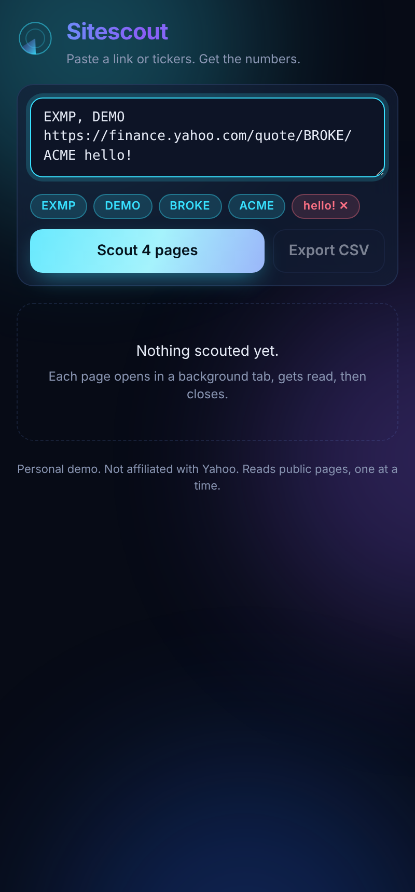 | **2. You type, it understands.** Each ticker or link becomes a blue chip as you type. Anything it can't use (here, `hello!`) becomes a red chip with the reason on hover. Repeats are removed. |
| 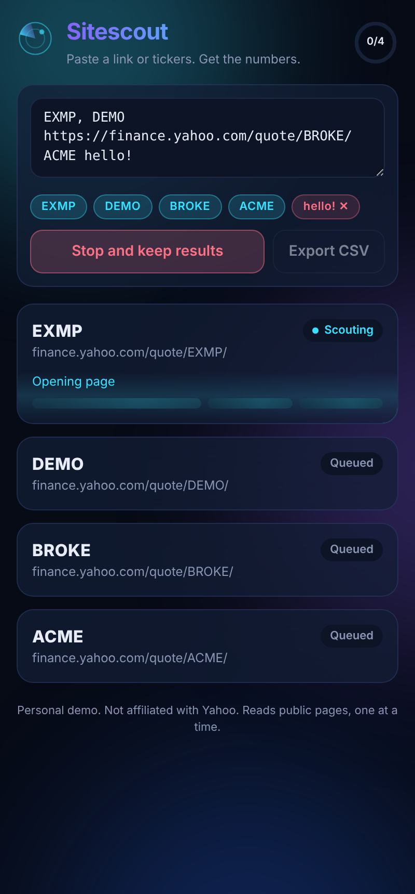 | **3. Scouting.** The card being worked on gets a spinning border, a scanning light and a live status ("Opening page", "Waiting for prices", "Reading numbers"). The ring at the top right counts finished pages. The button becomes **Stop and keep results**. |
| 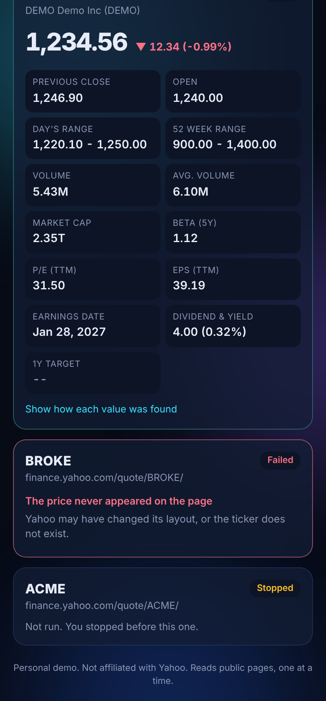 | **4. Results, honestly labelled.** Finished cards count the price up and stagger the numbers in. A red card says exactly what went wrong. Pages you stopped before are marked "Not run". |
| 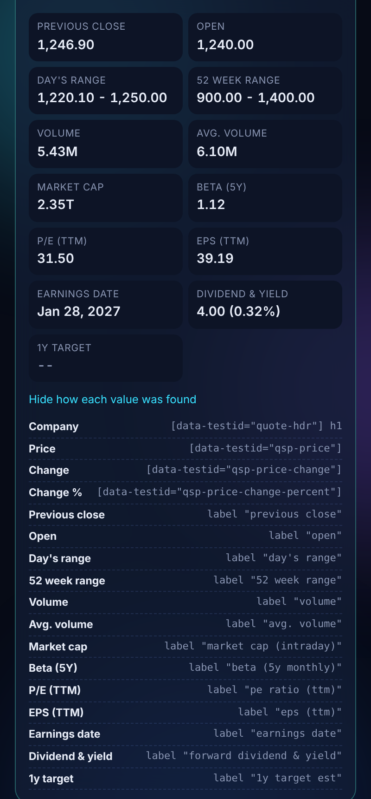 | **5. Show your working.** "Show how each value was found" lists, for every number, the exact spot on the page it was read from. Useful for trust and for fixing things. |

### How it works, in plain English

Think of Sitescout as a careful assistant with a checklist.

- **The checklist is the recipe.** It says: "the company name is the big heading; the price is the element labelled `qsp-price`; the P/E ratio is in the statistics table on the row called *PE Ratio (TTM)*", and so on for 17 numbers.
- **The assistant opens each page in a back room** (a hidden background tab), so your own browsing isn't disturbed.
- **It waits until the page is actually ready.** Modern pages arrive in pieces; reading too early gives blanks. Sitescout checks every half second for the price to appear, and gives up after 15 seconds.
- **It reads the page with the checklist** and notes, for each number, where it found it.
- **It closes the back room, pauses for a moment, and moves to the next page.** The pause keeps it polite: one page at a time, at roughly a human pace.
- **If the checklist doesn't match the page any more, it says so** instead of guessing.


<details>
<summary>Same flow chart as Mermaid (renders on GitHub)</summary>

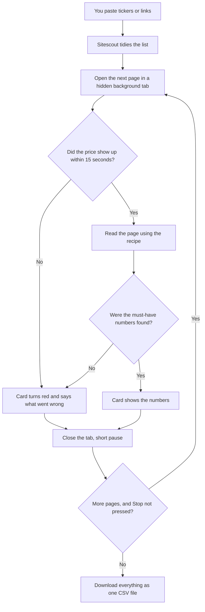
</details>

### Is this Selenium? What it uses instead, and why

**No.** Sitescout doesn't use Selenium, Playwright, Puppeteer, or a Python scraper. It is a **Chrome extension**: a small app that lives inside your own Chrome and uses Chrome's built-in tools to open tabs and read pages.

A quick comparison of the common ways to pull information from websites:

| Approach | What it is | Good at | Why I didn't use it for Sitescout |
|---|---|---|---|
| **Selenium** | A tool that remote-controls a browser from a separate program, usually Python or Java. Built for automated testing. | Long unattended jobs on a server; testing websites. | Needs a separate program and a driver set up on every computer. A non-technical user can't just click an icon. |
| **Playwright / Puppeteer** | Newer remote-control tools for browsers, from Microsoft and Google. | Fast, reliable automation and testing. | Same: built for developers running scripts. **I did use Playwright, but only to test Sitescout** (see below). |
| **Python + requests + BeautifulSoup** | Download the raw page text and pick it apart, with no browser at all. | Simple, very fast on plain pages. | Yahoo builds much of its page with JavaScript after it loads, so the raw download is often missing the numbers. |
| **An official data API** | A service that hands over data in a clean format, often paid. | The most reliable option when one exists. | Paid or rate-limited, and the point here is to show page-reading skills. |
| **Chrome extension (what Sitescout is)** | Code that runs inside your own Chrome, using Chrome's tab and scripting tools. | Runs where people already work. One click to start. Sees the page exactly as you do, after JavaScript has run. | Chosen. It's the same approach Undercut uses at work, which is the point of this rebuild. |

### Under the hood


Sitescout has five small parts, all inside Chrome:

| Part | File | What it does |
|---|---|---|
| **Side panel** | `src/panel/App.tsx`, `JobCard.tsx` | Everything you see and click. Built with React (a library for building screens out of reusable pieces) and Framer Motion (a library for animation). |
| **Runner** | `src/scrape/runner.ts` | Opens each page in a background tab, waits until it's ready, sends in the reader, closes the tab, pauses, and listens for Stop. |
| **Reader** | `src/scrape/extract.ts` | The code that actually reads the page. Chrome copies it into the page and runs it there. |
| **Recipe** | `src/recipes/yahooFinanceQuote.ts` | The checklist: 17 numbers, where each one lives, and how to clean it up. |
| **Service worker** | `src/background.ts` | A tiny background script that opens the panel when you click the toolbar icon. |

**The order of events for one run:**

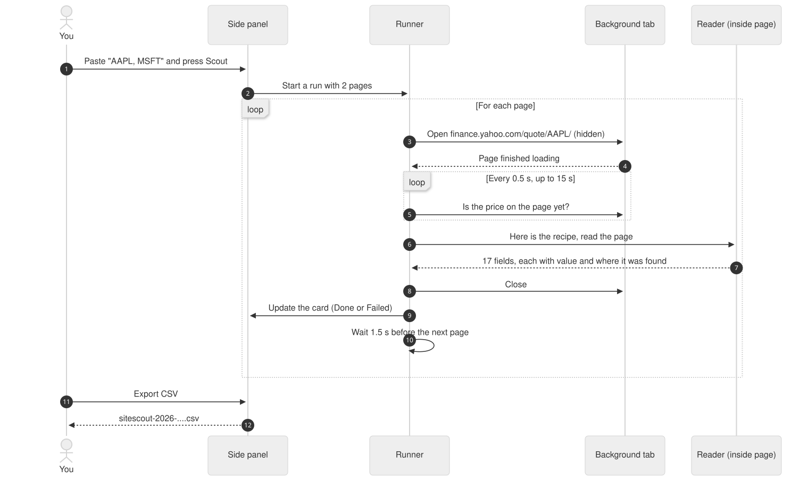

<details>
<summary>Same diagram as Mermaid</summary>

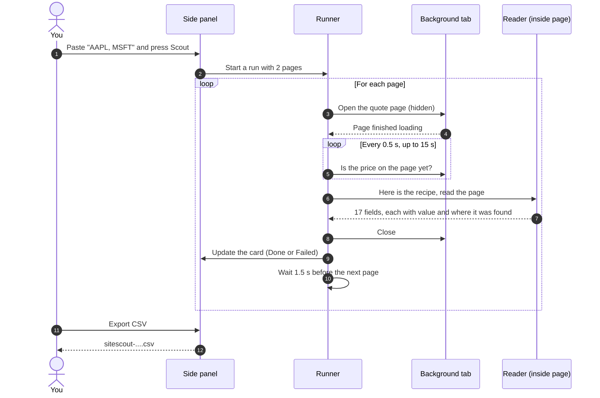
</details>

#### What a recipe looks like

This is a shortened piece of the real recipe. Each entry says what the number is called, where to look, and how to clean it up.

```ts
{
  key: "price",
  label: "Price",
  // Try these spots on the page, in order. The first one with text wins.
  selectors: ['[data-testid="qsp-price"]', 'fin-streamer[data-field="regularMarketPrice"]'],
  parse: "number",     // "1,234.56" becomes 1234.56
  required: true,      // if this is missing, the whole page counts as failed
},
// For the statistics table, find the row by its label, not its position:
stats("pe", "P/E (TTM)", ["PE Ratio (TTM)"], "number"),
stats("marketCap", "Market cap", ["Market Cap (intraday)", "Market Cap"], "compact"),  // "2.345T" becomes 2,345,000,000,000
```

A **selector** is an address for a piece of a web page, a bit like "third shelf, blue box". Sitescout keeps a list of backup addresses for each number, and for table rows it looks for the **label text** ("PE Ratio (TTM)") rather than "the ninth row", because labels change far less often than layouts.

#### Four details that make it robust

1. **Cleaning numbers properly.** Pages show numbers for humans: `1,234.56`, `(-0.99%)`, `2.345T`, `--`. The reader turns these into real numbers (`1234.56`, `-0.99`, `2345000000000`) and treats `--` as "no value", **not zero**. A missing value that turns into a zero is the kind of quiet error that ruins a spreadsheet.
2. **The reader is fully self-contained.** Chrome sends the reader into the page as plain text, so it can't depend on anything outside itself. A test rebuilds it from its own text and runs it, to prove nothing is missing.
3. **Tabs are always closed**, even if a page fails or you press Stop. No pile of stray tabs.
4. **Specific error messages.** "The price never appeared on the page", "Yahoo showed a cookie consent page" (with what to do about it), "The link redirected somewhere unexpected". Each one points to a cause.

### What happens when a website changes

Websites redesign constantly, and every page reader breaks eventually. The real question is **how** it breaks.

The bad way: the tool keeps running, the spreadsheet fills with blanks or wrong numbers, and nobody notices until a decision has been made on bad data.

Sitescout's way: every recipe marks some numbers as **must-have** (company name and price). If a must-have can't be found, the page is marked **Failed**, the card turns red, and it names what's missing. Everything else in the run carries on.

To prove this, I made a second practice page that holds the same information but is built differently, the way a real redesign would be: new names, a table instead of a list. Sitescout correctly refused it:


### Languages and tools

| What | Used for | Why this one |
|---|---|---|
| **TypeScript** | All the code | JavaScript with labels on every piece of data ("this is a number", "this might be missing"). Catches many mistakes before the code runs. |
| **React** | The side panel screens | Builds screens from small reusable pieces (a card, a chip, a progress ring). |
| **Framer Motion** | Animation | Smooth springs, staggered numbers, count-up prices, the shake on failure. Respects the "reduce motion" setting for people who find animation uncomfortable. |
| **CSS** | Look and feel | Glass-style cards, gradient title, drifting background, light and dark themes that follow your computer's setting. |
| **Chrome Extension APIs (Manifest V3)** | Opening tabs, running the reader, the side panel | The current standard for Chrome extensions. `chrome.tabs`, `chrome.scripting`, `chrome.sidePanel`. |
| **Vite** | Building the extension | Turns the TypeScript and React code into the files Chrome loads, in under a second. |
| **Vitest + jsdom** | Unit tests | Runs the reader against practice pages without opening a browser. |
| **Playwright** | End-to-end test and screenshots | Loads the real extension in Chromium and clicks through it like a person would. **Testing only. Sitescout itself doesn't use it.** |
| **Mermaid** | Diagrams | Diagrams written as text, so they live in the repo and change with the code. |

### How I tested it

There are three layers, from fastest to most realistic.

**1. Unit tests (13 tests, all passing).** These check single pieces in isolation:
- the reader gets all the right numbers from a practice page, including turning `2.345T` into 2.345 trillion and `--` into "no value";
- the reader **fails loudly** on the redesigned practice page;
- the reader still works after being turned into text and back (the self-contained check);
- typed input is understood: commas, spaces, new lines, links, index symbols like `^GSPC`, and junk;
- the CSV is written correctly, including names with commas and quotes in them.

**2. End-to-end demo.** A script (`scripts/demo.mjs`) loads the real, built extension into Chromium, types into the panel, presses Scout, presses Stop part way, exports the CSV, and takes the screenshots on this page. It runs against **practice pages**, not Yahoo: Chromium is told that `finance.yahoo.com` lives on a small local server that serves the practice pages. Nothing is sent to Yahoo.

Why practice pages? The computer I built this on can't reach Yahoo at all (its network blocks it), and a test that depends on a live website breaks whenever that website changes. Practice pages give a repeatable test; the live run below checks the real thing.

The practice pages are in `test/fixtures/`. They are **hand-written** to look like Yahoo's page structure, use a made-up company and made-up numbers, and say so at the top of the file.

**3. Live run on Yahoo Finance.** I loaded the extension in my own Chrome and ran it against real Yahoo Finance pages. See [Results](#results).

### Results

#### Demo run (practice pages)

Input: `EXMP, DEMO, <link to BROKE>, ACME, hello!`, with Stop pressed during the last page.

| Page | Outcome | Numbers found |
|---|---|---|
| EXMP | Done | 16 of 17 |
| DEMO | Done | 16 of 17 |
| BROKE (redesigned page) | Failed: "The price never appeared on the page" | 0 |
| ACME | Stopped: not run | n/a |
| `hello!` | Rejected before the run: "Not a ticker or a link" | n/a |

The one number not found on EXMP and DEMO is the 1-year price target, which the practice page deliberately shows as `--` to check that blanks stay blank.

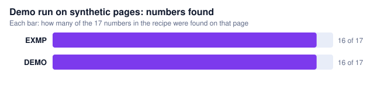

#### Live run (Yahoo Finance)

> **[TO FILL: live results.]** Run Sitescout on 10 or so real tickers, export the CSV, save it as `docs/live-run-YYYY-MM-DD.csv.txt`, and take a screenshot of the panel. Then run
> `node scripts/chart.mjs docs/live-run-YYYY-MM-DD.csv.txt docs/charts/live-fields-found.svg "Live run on Yahoo Finance: numbers found"`
> to make the chart, and fill in this table from the CSV. Only numbers from that run go here.

| Date | Tickers tried | Done | Failed | Notes |
|---|---|---|---|---|
| [TO FILL] | | | | |

### What went wrong while building it

Recorded honestly, because this is how the tool got better.

1. **The test browser couldn't intercept the extension's own tabs.** My first end-to-end test tried to catch requests to Yahoo and answer them with the practice pages. That works for tabs the test opens, but not for tabs the extension opens itself, so every card failed with Chrome's error page. **Fix:** run a small local web server and tell the test browser (only that one) that `finance.yahoo.com` lives there.
2. **Index symbols were rejected.** `^GSPC` (the S&P 500 index) starts with `^`, which the input check didn't allow. A unit test caught it. **Fix:** allow a leading `^`.
3. **A blank number looked broken.** An empty stat tile accidentally used the same style name as the empty-state message, so it rendered as a tall dashed box. Spotted in a screenshot. **Fix:** renamed the style.
4. **The logo spun around the wrong point.** The radar sweep rotated around the corner, not the centre. Spotted in a screenshot. **Fix:** set the rotation centre explicitly.
5. **The "running" screenshot showed nothing running.** Practice pages loaded instantly, so the in-progress state was gone before the screenshot. **Fix:** the practice server now waits briefly before answering, like a real page.

Full dated log: [NOTES.md](NOTES.md).

### Limits and responsible use

- **Personal demo, not affiliated with Yahoo.** It reads public pages that anyone can open, in your own browser, one page at a time with a pause between them. It doesn't log in, get around blocks, or run in bulk on a server.
- **It will break when Yahoo changes its pages.** That's true of every page reader. Sitescout's job is to say so clearly. Fixing it means updating the recipe.
- **Only Yahoo Finance quote pages for now.** Other kinds of page need their own recipe.
- **Prices may be delayed** on the source page; Sitescout copies what the page shows.
- **Not financial advice.**

### Run it yourself

You need [Node.js](https://nodejs.org) and Chrome.

```bash
git clone https://github.com/kmsmohamedansar/kmsmohamedansar.github.io.git
cd kmsmohamedansar.github.io/projects/sitescout
npm install
npm test        # 13 unit tests
npm run build   # builds the extension into the dist folder
```

Then in Chrome:
1. Go to `chrome://extensions` and turn on **Developer mode** (top right).
2. Click **Load unpacked** and choose the `dist` folder.
3. Click the Sitescout icon in the toolbar (pin it from the puzzle-piece menu).
4. Type `AAPL, MSFT` and press **Scout**.

To re-make the screenshots and demo CSV: `npm run demo`. To re-make the diagram images: `node scripts/render-diagrams.mjs`.

### What's next

- **Click to repair.** When a number breaks, click it on the page and Sitescout writes the new address into the recipe.
- **More recipes.** Yahoo Finance's financial statements page, and Yahoo News headlines for a ticker.
- **Optional local AI suggestion.** A model running on your own computer (through Ollama, free) proposes a recipe for a new kind of page; you approve it before anything runs.
- **Compare view.** A side-by-side table of all scouted stocks inside the panel.

---

## Every claim on this page, and where it is backed up

| Claim | Evidence |
|---|---|
| 13 unit tests, all passing | `npm test`; tests in `test/` |
| Reads 17 numbers per quote page | `src/recipes/yahooFinanceQuote.ts` (17 fields) |
| Name and price are must-haves; missing ones fail the page | `required: true` in the recipe; `missing` in `src/scrape/extract.ts`; test "fails loudly" in `test/extract.test.ts` |
| `2.345T` becomes 2.345 trillion; `--` becomes no value | `parse` in `src/scrape/extract.ts`; tests "expands K/M/B/T" and "treats -- as empty" |
| Reader is self-contained | test "survives being sent into a page" in `test/extract.test.ts` |
| Checks every 0.5 s, gives up after 15 s; page load limit 30 s | `src/scrape/runner.ts` |
| 1.5 s pause between pages | `POLITE_DELAY_MS` in `src/panel/App.tsx` |
| Tabs always closed | `finally` block in `scrapePage`, `src/scrape/runner.ts` |
| Stop keeps finished rows, marks the rest not run | `run()` in `src/panel/App.tsx`; screenshot `05-failed-loudly.png`; NOTES.md 2026-10-10 |
| Demo results table (EXMP, DEMO 16 of 17; BROKE failed; ACME stopped; `hello!` rejected) | `npm run demo` output; `docs/demo-export.csv.txt`; NOTES.md 2026-10-10 |
| Screenshots come from the real extension | `scripts/demo.mjs` loads `dist/` with `--load-extension` |
| Demo never contacts Yahoo | `--host-resolver-rules` in `scripts/demo.mjs` maps the address to a local server |
| Practice pages are synthetic | comments at the top of `test/fixtures/*.html` |
| Respects "reduce motion" | `MotionConfig reducedMotion="user"` in `src/panel/main.tsx`; `prefers-reduced-motion` in `styles.css` |
| Doesn't use Selenium or Playwright at runtime | `package.json`: Playwright is a dev dependency only; runtime uses `chrome.tabs` and `chrome.scripting` in `runner.ts` |
| Live run results | **[TO FILL]** `docs/live-run-*.csv.txt` |
| Undercut facts in Chapter 1 | Mohamed's own description; private tool, not in this repo |

---

## Glossary

- **API**: a doorway one program offers so other programs can ask it for data or actions in a fixed format.
- **Chrome extension**: a small app that adds features to the Chrome browser.
- **CSV**: a plain text spreadsheet file. Each line is a row; commas separate the columns. Opens in Excel or Google Sheets.
- **End-to-end test**: a test that uses the whole product the way a person would, start to finish.
- **Fixture**: a fixed sample used in tests, here a hand-made practice web page.
- **Manifest V3**: the current set of rules for how Chrome extensions are built.
- **Market cap**: share price times the number of shares; roughly what the whole company is worth on the stock market.
- **P/E ratio**: price divided by earnings per share. A common way to compare how expensive stocks are.
- **Recipe**: in Sitescout, a short list of what to read from a kind of page and where each piece lives.
- **Scraping**: reading information out of web pages with a program instead of by hand.
- **Selector**: an address for one piece of a web page.
- **Service worker**: a small background script an extension uses to react to events, like clicking its icon.
- **Side panel**: a panel Chrome shows on the right of the window, beside the page.
- **Ticker**: the short code a stock trades under, like `AAPL` for Apple.
- **Unit test**: a small automatic check of one piece of code.
