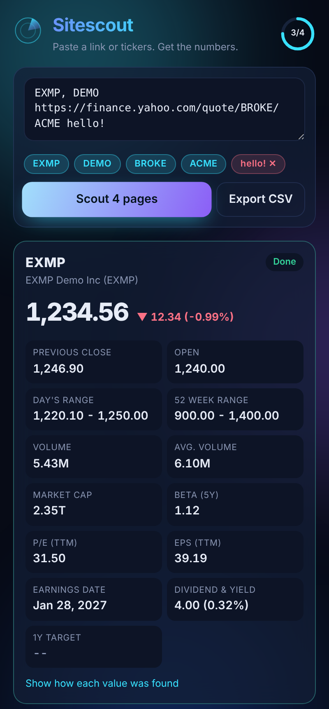
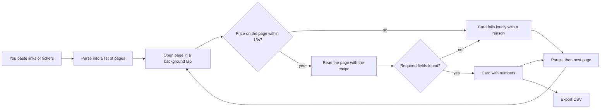

# Sitescout

A Chrome side panel that reads stock pages for you. Paste Yahoo Finance quote links or tickers (`AAPL, MSFT, NVDA`), press **Scout**, and watch each page get opened in a background tab, read, and closed. You get the key numbers as cards and one CSV file.

Personal demo. Not affiliated with Yahoo. It reads public pages, one at a time, in your own browser.



## What it does

- **Takes messy input.** Tickers separated by commas, spaces or new lines, full quote links, index symbols like `^GSPC`. Anything it can't use is shown as a red chip with the reason.
- **Reads each page with a recipe.** A recipe is a small file that lists the pieces of a page to grab and where they live (`src/recipes/yahooFinanceQuote.ts`). Adding a new kind of page means writing a new recipe, not new code.
- **Reads label and value pairs by their label.** For the statistics table it looks for the row called "PE Ratio (TTM)" rather than the 9th row, so small layout shifts don't scramble the columns.
- **Fails loudly.** If the page changes and the price can't be found, the card turns red and says what broke. It never hands back a row of blanks that looks like success.
- **Can be stopped any time.** Stop keeps everything finished so far and marks the rest as not run.
- **Reads politely.** One page at a time, with a pause between pages.
- **Shows its working.** Every value can show which selector or label it came from.

## How it works



The reading function (`src/scrape/extract.ts`) is copied into the page by Chrome as text, so it is written to be fully self-contained. A test rebuilds it from its own text to prove that.

## Run it

```bash
npm install
npm test          # unit tests
npm run build     # builds the extension into dist/
```

Then open `chrome://extensions`, turn on Developer mode, choose **Load unpacked**, and pick the `dist` folder. Click the Sitescout icon to open the panel.

If you're in a region where Yahoo shows a cookie consent page, open finance.yahoo.com in a normal tab once and answer it. Sitescout tells you when this is the problem.

## How it was tested

- `npm test` runs unit tests against two **synthetic** pages in `test/fixtures`. These are hand-written to look like Yahoo's markup and use made-up numbers. One has the expected layout; the other is a "redesigned" version used to prove the loud failure.
- `npm run demo` loads the real built extension in Chromium and drives it end to end. Chromium is pointed at a local server that answers for finance.yahoo.com with the synthetic pages, so Yahoo is never contacted. This produced the screenshots in `docs/screenshots`.
- The live Yahoo site has **not yet** been tested. See NOTES.md.

## Stack

TypeScript, React, Framer Motion, Vite, Chrome Manifest V3 (side panel, scripting). Tests with Vitest and jsdom; end-to-end demo with Playwright.

## License

All rights reserved. See LICENSE.
